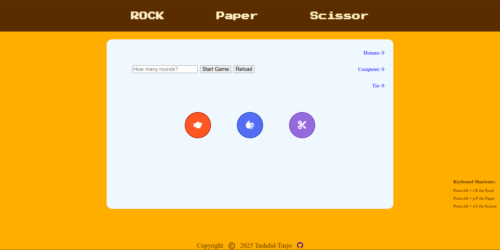

# 🎮 Rock Paper Scissors — My First Web Project

This is a simple **Rock Paper Scissors** game built using **HTML**, **CSS**, and **JavaScript**.
Users can select Rock, Paper, or Scissors through buttons or keyboard shortcuts, and the computer generates a random choice each round.
The game also supports round limits, score tracking, animations, and keyboard interactions.

This is my first raw project, created while learning JavaScript and DOM manipulation.

---

## 🕹️ Live Demo
You can try out the live version of this project: [Rock-Paper-Scissors](https://tashdid-turjo.github.io/JS-Project-Rock-Paper-Scissors/).

---

## 🚀 Features

- Play Rock, Paper, Scissors against the computer
- Round selection and automatic scoring
- Smooth UI animations (fade-in/out, icon movement, etc.)
- Keyboard shortcuts
  - `/` → Focus input
  - `Enter` → Start game
  - `R`, `P`, `S` → Choose Rock / Paper / Scissors
- Responsive interface with custom design
- Fully deployed on GitHub Pages

---

📂 Technologies Used

- HTML5
- CSS3 (animations, flexbox, transitions)
- JavaScript (ES6)
- Font Awesome (icons)

---

## 📌 Notes

This was created as my first small project while learning JavaScript.
It's not a full application, but it is more than a simple task — it qualifies as a small beginner project, especially because it includes:

✔ DOM Manipulation  
✔ Event Handling  
✔ Animations  
✔ Game Logic  
✔ Keyboard shortcuts  
✔ GitHub Pages Deployment  

---

## 📸 Screenshots:

